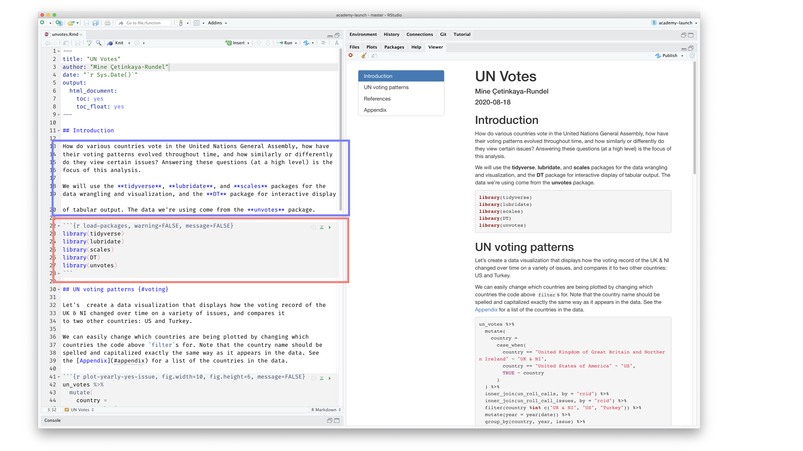

```{r child = "../setup.Rmd"}
```

```{r packages, echo=FALSE, message=FALSE, warning=FALSE}
library(tidyverse)
library(emo)
```

class: middle

# Hello world!

---

class: middle

## Prof. Yph Lelkes

---

## Data science

.pull-left-wide[
- Data science is an exciting discipline that allows you to turn raw data into understanding, insight, and knowledge. 

- We're going to learn to do this in a `tidy` way -- more on that later!

- This is a course on introduction to data science, with an emphasis on statistical thinking.
]

---

## Course FAQ

.pull-left-wide[
**Q - What data science background does this course assume?**  
A - None.

**Q - Is this an intro stat course?**  
A - While statistics $\ne$ data science, they are very closely related and have tremendous of overlap. Hence, this course is a great way to get started with statistics. However this course is *not* your typical high school statistics course.

**Q - Will we be doing computing?**   
A - Yes.
]

---

## Course FAQ

.pull-left-wide[
**Q - Is this an intro CS course?**  
A - No, but many themes are shared.

**Q - What computing language will we learn?**  
A - R.

**Q: Why not language X?**  
A: We can discuss that over `r emo::ji("coffee")`.
]

---

## What does data science look like?

```{r echo=FALSE, out.width="95%", out.width="100%", fig.align="left"}
knitr::include_url("https://fivethirtyeight.com/features/the-spurs-young-trio-has-them-back-in-the-mix/")
```

---

## What does data science look like?

```{r echo=FALSE, out.width="100%", out.width="100%", fig.align="left"}
knitr::include_url("http://varianceexplained.org/r/trump-tweets")
```

---

## One link to rule them all...

<br>

.larger[
.center[
[**canvas**](https://canvas.upenn.edu/courses/1558484/)
]
]

---

class: middle

# Software

---

```{r echo=FALSE, out.width="75%", fig.align="left"}
knitr::include_graphics("img/excel.png")
```

---

```{r echo=FALSE, out.width="75%", fig.align="left"}
knitr::include_graphics("img/r.png")
```

---

```{r echo=FALSE, out.width="73%", fig.align="left"}
knitr::include_graphics("img/rstudio.png")
```

---

class: middle

# Data science life cycle

---

```{r echo=FALSE, out.width="90%", fig.align="left"}
knitr::include_graphics("img/data-science-cycle/data-science-cycle.001.png")
```

---

```{r echo=FALSE, out.width="90%", fig.align="left"}
knitr::include_graphics("img/data-science-cycle/data-science-cycle.002.png")
```

---

```{r echo=FALSE, out.width="90%", fig.align="left"}
knitr::include_graphics("img/data-science-cycle/data-science-cycle.003.png")
```

---

```{r echo=FALSE, out.width="90%", fig.align="left"}
knitr::include_graphics("img/data-science-cycle/data-science-cycle.004.png")
```

---

```{r echo=FALSE, out.width="90%", fig.align="left"}
knitr::include_graphics("img/data-science-cycle/data-science-cycle.005.png")
```

---

```{r echo=FALSE, out.width="90%", fig.align="left"}
knitr::include_graphics("img/data-science-cycle/data-science-cycle.006.png")
```

---

.pull-left[
```{r echo=FALSE, out.width="90%", fig.align="left"}
knitr::include_url("http://varianceexplained.org/r/trump-tweets")
```
]
.pull-right[
```{r echo=FALSE, out.width="90%", fig.align="right"}
knitr::include_graphics("img/data-science-cycle/data-science-cycle.006.png")
```
]

---

```{r echo=FALSE, out.width="85%", fig.align="left"}
knitr::include_graphics("img/unvotes/unvotes.gif")
```

---

class: middle
# Let's dive in!

---

background-image: url("img/unvotes/unvotes-01.jpeg")

---

class: inverse

```{r echo=FALSE, out.width="100%"}

```

---

class: inverse

```{r echo=FALSE, out.width="100%"}

```

---

class: inverse

```{r echo=FALSE, out.width="100%"}

```

---

class: inverse

```{r echo=FALSE, out.width="100%"}

```

---

class: inverse

```{r echo=FALSE, out.width="100%"}
knitr::include_graphics("img/unvotes/unvotes-07.jpeg")
```

---

class: inverse

```{r echo=FALSE, out.width="100%"}

```

---

class: inverse

```{r echo=FALSE, out.width="100%"}

```

---

class: inverse

```{r echo=FALSE, out.width="100%"}
knitr::include_graphics("img/unvotes/unvotes-14.jpeg")
```

---

## AE 01 - First dataviz and introductions

Go into breakout rooms. 
Introduce yourselves: name, hobby, where you are currently living, first thing you'll do post-pandemic, what you find interesting/intriguing (if anything) about data science, one thing a prof has done to make (zoom) class a better experience, one thing a prof has done to make (zoom) class a worse experience. 

Add details here: https://docs.google.com/presentation/d/13ZluIiTTTlpx-avTXphqSnTc50MrQqPZnhkiNzif6CQ/edit?usp=sharing

Then, do one of the following exercises. 

You have two options for this exercise:

- Option 1: Voting patterns of countries in the UN General Assembly

- Option 2: COVID-19 fatality numbers across the globe

Pick one and complete it. Optionally, try the other one as well.

---

.your-turn[
**Option 1.**

- Go to [RStudio Cloud](https://rstudio.cloud/) and start `AE 01a - First dataviz - UN Votes`.
- In the Files pane (bottom right corner), spot the file called `unvotes.Rmd`. 
- Open it and click "Knit".
- Then...
  - Go back to the file and change your name on top (in the `yaml` -- we'll talk about what this means later) and knit again.
  - Change the country names to those you're interested in. Spelling and capitalization must match how the countries appear in the data, so take a peek at the Appendix to confirm spelling. 
  - Knit again. Voila, your first data visualization!
]

---

.your-turn[
**Option 2.**

- Go to [RStudio Cloud](https://rstudio.cloud/) and start `AE 01b - First dataviz - COVID-19`.
- In the Files pane (bottom right corner), spot the file called `covid.Rmd`.
- Open it and click "Knit".
- Then...
  - Go back to the file and change your name on top (in the `yaml` -- we'll talk about what this means later) and knit again.
  - Change the country names to those you're interested in. Spelling and capitalization must match how the countries appear in the data, so take a peek at the Appendix to confirm spelling. 
  - Knit again. Voila, your first data visualization!
]
